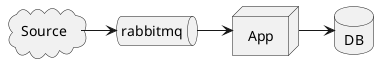
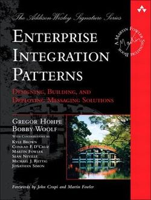

# Exemplos de uso do MassTransit com o RabbitMq

## Introduction

### Types of Communication
- REST
- SOAP
- RPC
- **Message**

> Escrever sobre mensagens ?

### Falacies of Distributed Computing
- The network is reliable
- Latency is zero
- Bandwidth is infinite
- The network is secure
- Topology doesn't change
- There is one administrator
- Transport cost is zero
- The network is homogeneous

## Transactions

Menssages should be threated like data, with transactions, it is not only a communication system, it is a transactional distributed system.

Watching microsservices videos online on people talking about eventual consistence may lead to think you can forget about transactions. This is mistake, in reality transactions play a much more important role in a distributed system, and should be carefuly thought.

Most modern queue systems implement "At-Least-Once Delivery" (as oposed to "At-Most-Once"), like rabbit does. It means that (if you do things right), It is guarateed that you will not loose messages. Howerver, the transaction should be part of your system.


 - at-most-once, 
 - at-least-once, 
 - and exactly-once

**RABIT::**
- Queues: 
  - Durable
  - Auto-Delete
  - Exclusive
- Messages: 
  - Persistent


**BASIC EXAMPLE**


- Send & Receive
- Ack

###Types of Messages:
- Commands
- Events
- Query

## Message Broker

### Message Patterns
- Point-To-Point (Fire & Forget)
- Publish-Subscribe (Broadcast, Fan-out & Fan-In)
- Request-Client
- Courier (Routing-Slip)
- Saga (Process-Manager)
- Competing Consumers
- Others...



## Why Masstransit ?

- Design Patterns implementation
- Tracing, Logging , Monitoring
- Error Handling (Exceptions, Retry, Dead-Letter, etc)
- Queue Transparency (RabbitMq, Azure SB)
- Concurrency
- Unit Testing
- Contract Binding & Serialization
- Scheduling
- Plugins

Implementation of best practices for message driven architecture are hard, and very error prone. Complex system should leverage existing tecnologies with proven tested implementations, trying to implemnt them from scrach will consume a long time, and will be error prone.

Although configurable, it is higly opinonated which steer us towards best practices, and away from reinventing the wheel.


### EXAMPLE
- Mostrar exemplo servico Conta-Corrente
  - Boas praticas para criacao de dll contrato
  - Configuracao do servico
  - Consumidor DebitaValor
    - Transação

  - Consumidor PegaSaldoContas
    - Respostas

  - UI 
    - Configuracao
    - Send
    - Request-Client

  - Competing consumers


**EXEMPLO2**
```plantuml
cloud SPB
(UI) -> (Autorizador)
(Autorizador) -> (ContaCorrente)
(ContaCorrente) -> (SPB)

```